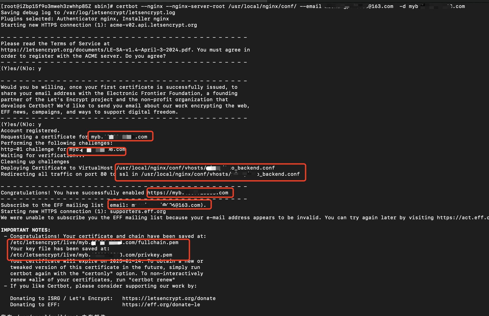

# certbot 自动部署证书

本文详细介绍如何使用 Let's Encrypt 和 Certbot 免费申请 SSL 证书，并实现自动申请、自动部署以及自动续约。

Certbot 是一个免费的、开源的命令行工具。它可以极大的简化我们为网站启用 HTTPS 的过程，它提供自动化获取、安装、续订和管理 Let’s Encrypt 提供的 SSL/TLS 证书的功能。

## 安装 Certbot

Certbot 的安装方法取决于你的操作系统和包管理器, 请参考[Certbot 的官方文档](https://certbot.eff.org/instructions?ref=ivensliaoblog.com)。

```bash
# Ubuntu  
sudo apt-get update 
sudo apt-get install certbot

# CentOS 
sudo yum install certbot 
```

命令如下：

```bash
sudo certbot certonly \
    --email example@qq.com \
    --server https://acme-v02.api.letsencrypt.org/directory \
    --agree-tos \
    --manual \
    --preferred-challenges=dns  \
    -d *.example.com
```

泛域名只能使用 DNS 验证，需要你在 DNS 中添加一个特定的记录，因此只能手动申请。
泛域名不支持到期自动续约，到期后需要手动再次申请。

- `certbot`: Certbot 工具名称。
- `certonly`: 这个子命令告诉 certbot 仅获取证书，而不尝试自动配置任何服务器来使用它。
- `--email`: example@qq.com, Let's Encrypt 要求在生成 SSL 证书时提供有效的联系电子邮件地址。
- `--server`【可选】: https://acme-v02.api.letsencrypt.org/directory, 指定 Certbot 生成证书的 ACME 服务器。这里使用 Let's Encrypt v2 API 端点。
- `--agree-tos`【可选】: 同意 Let's Encrypt 的服务条款。
- `--manual`【可选】: 指定使用手动模式生成证书。这意味着您需要在命令提示符下手动操作来验证您拥有该域名。
- `--preferred-challenges=dns`【可选】: 指定 Certbot 使用 DNS 验证方式进行证书颁发。这表示您需要将一个特定的 TXT 记录添加到 DNS 进行验证, 添加完成之后，回到终端，按回车确认。若验证通过，将会自动签发并下载证书文件。
- `-d` 'example.com': 指定您想要为其生成 SSL 证书的域名。你可以通过添加多个 -d 选项来同时为多个域名生成证书。

**请注意**，由于 `--manual` 选项需要手动操作，因此它可能比其他选项耗费更多时间。另外，使用 DNS 验证时需要在 DNS 服务商处添加 TXT 记录以实现验证，这在某些情况下可能会比较困难，也需要等待 DNS 缓存刷新。在选择选项时，请根据您的需求和特定情况来作出最合适的选择。

我们可以把 `--manual` `--preferred-challenges=dns` 替换成 `--preferred-challenges=http-01`并配置 Nginx 服务器的相应设置，使用 HTTP 验证方式生成证书。

## 自动申请(http-01)

自动申请证书只能用于单个域名，不能申请泛域名（泛域名申请必须使用 DNS 验证，所以必须手动验证）。
使用 `certbot` 可以实现自动申请证书，并在证书到期后自动续约 SSL 证书，但是需要安装格外的插件服务器插件（如 `--nginx` 或 `--apache`）。

```bash
# Nginx
sudo yum install python2-certbot-nginx

# Apache
sudo yum install python2-certbot-apache
```

### 1. 申请证书

```bash
sudo certbot  \
    --email example@qq.com \
    --nginx-server-root /usr/local/nginx/conf/  \
    --agree-tos \
    -d xx.example.com
```

如果成功的话，它会生成两个文件：
/etc/letsencrypt/live/example.com/fullchain.pem
/etc/letsencrypt/live/example.com/privkey.pem



最后重启 `nginx` 服务。

### 2. 手动续期

Certbot 是申请的Let’s Encrypt的免费证书，有效期 3 个月，到期之后我们可以再次续期，达到永久免费的效果。

你只需要在到期前，再手动执行生成证书的命令，重启 `nginx` 服务就ok啦。

### 3. 自动续期

你可以通过运行以下命令来测试自动续约是否工作：

```bash
# --dry-run 表示模拟，并不起真实作用
sudo certbot renew --dry-run

# 续订后记得重启 nginx服务
systemctl reload nginx
```

设置一个 `crontab` 计划任务来进行调度自动续约并重启 nginx 服务:

```bash
# 每月执行一次续订
0 0 1 * * certbot renew -quiet --renew-hook 'systemctl reload nginx'

```

解决阿里云 DNS 不能自动为通配符证书续期的问题:
[certbot-dns-aliyun](https://github.com/justjavac/certbot-dns-aliyun)